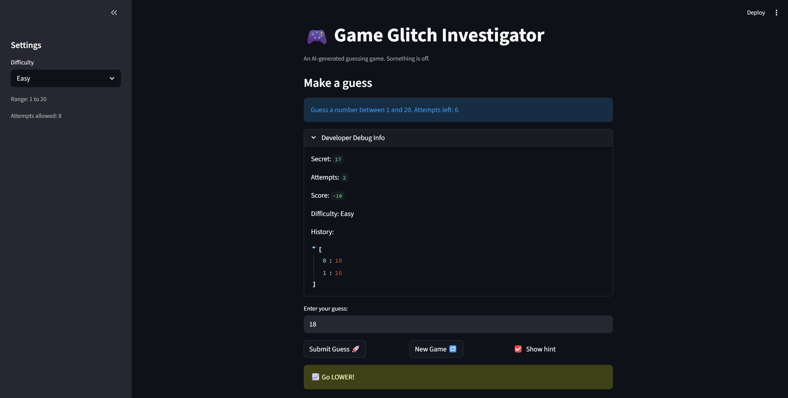

# 🎮 Game Glitch Investigator: The Impossible Guesser

## 🚨 The Situation

You asked an AI to build a simple "Number Guessing Game" using Streamlit.
It wrote the code, ran away, and now the game is unplayable. 

- You can't win.
- The hints lie to you.
- The secret number seems to have commitment issues.

## 🛠️ Setup

1. Install dependencies: `pip install -r requirements.txt`
2. Run the broken app: `python -m streamlit run app.py`

## 🕵️‍♂️ Your Mission

1. **Play the game.** Open the "Developer Debug Info" tab in the app to see the secret number. Try to win.
2. **Find the State Bug.** Why does the secret number change every time you click "Submit"? Ask ChatGPT: *"How do I keep a variable from resetting in Streamlit when I click a button?"*
3. **Fix the Logic.** The hints ("Higher/Lower") are wrong. Fix them.
4. **Refactor & Test.** - Move the logic into `logic_utils.py`.
   - Run `pytest` in your terminal.
   - Keep fixing until all tests pass!

## 📝 Document Your Experience

   This game is a simple number guessing game, meant to be dynamic to allow players to alter game difficulty, give helpful hints, and allow for endless gameplay.

   Some bugs found in the original code included inconsistent numbers between number ranges (which also displayed incorrectly), an illogical number of attempts for each game mode, improper hints (i.e. if the actual number was higher than the guessed number, it would sometimes give a hint to go higher instead of lower), as well as no way to actually replay the game or properly change the difficulty. To fix these issues, I made sure the state variables would reset and a new number would generate within the difficulty ranges whenever the new game button was pressed or when the difficulty was changed. I also manually changed some hardcoded difficulty numbers, such as the number ranges for difficulty and the number of guesses. To make sure some game logic was properly fixed, I implemented pytests.

## 📸 Demo

